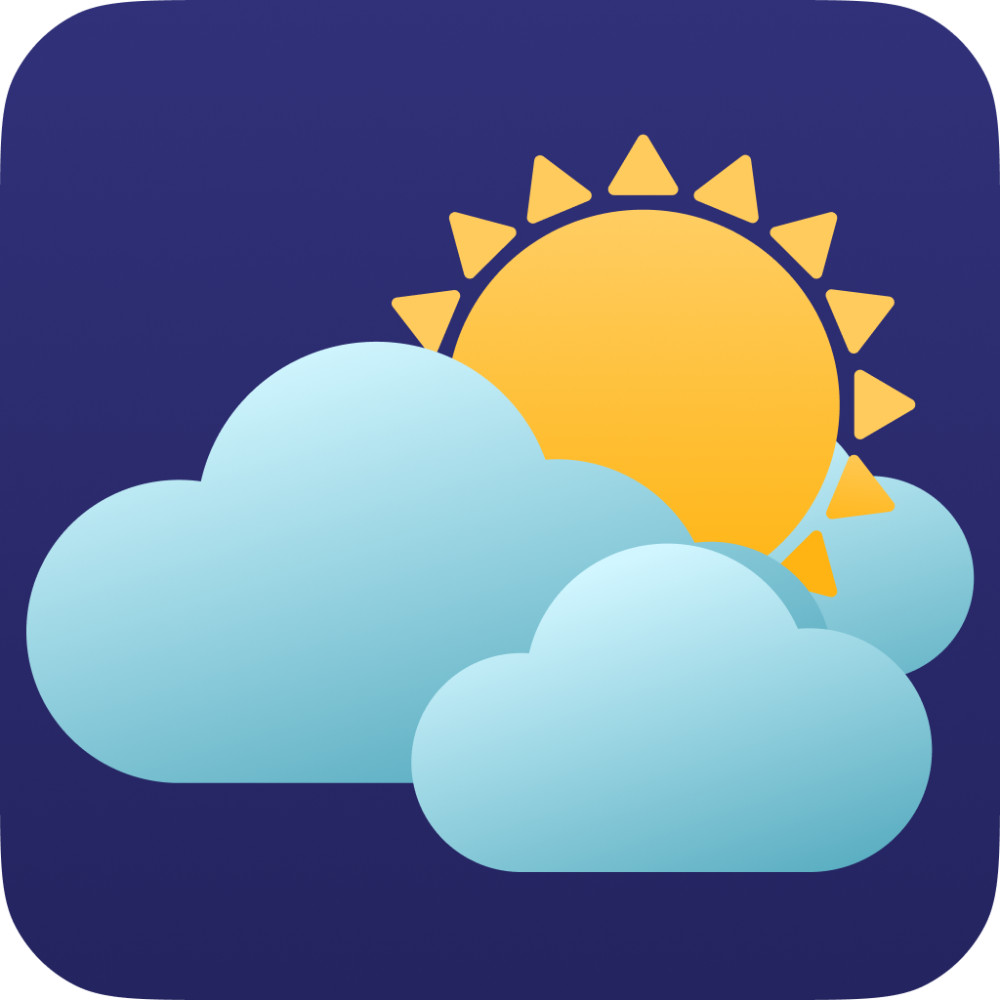
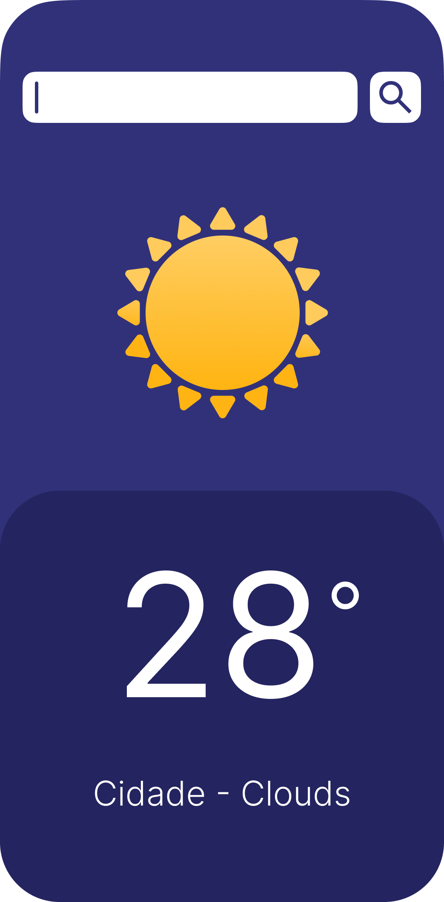
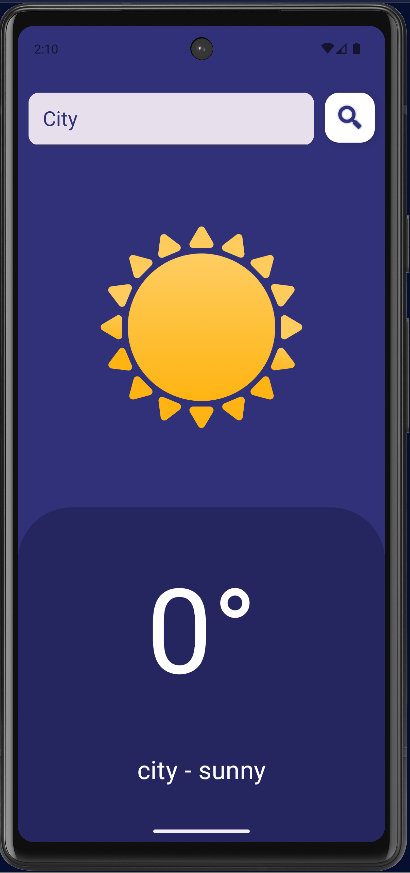
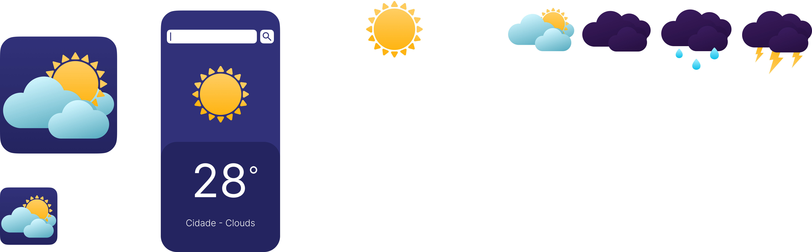
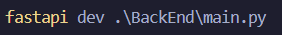
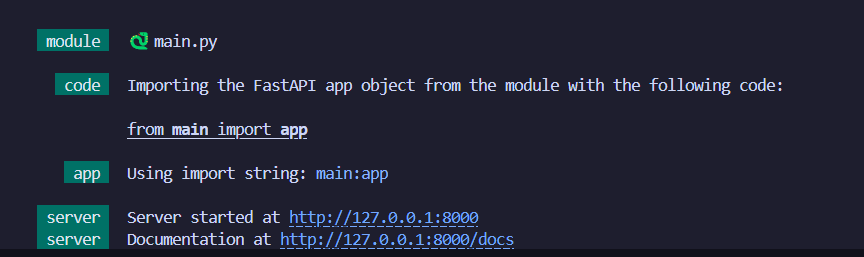

# Projeto de Aplicativo mobile de Clima - Formalmente: Climatize 


WeatherApp é um aplicativo de previsão do tempo para android desenvolvido com Jetpack Compose, utilizando a API do OpenWeather para obter dados meteorológicos e um backend FastAPI com Python 3.11 para processamento.

## 📷 Ilustrações
-             Tela Mockup 


-             Tela Final
 

## 📱 Figma 



## 📌 Funcionalidades

- Exibição de previsão do tempo em tempo real.
- Busca por cidade na barra de pesquisa.
- Interface moderna e responsiva.
- Exibição da sensação térmica em tempo real.

## 🛠️ Tecnologias Utilizadas

### 📱 Frontend (Jetpack Compose)

- Jetpack Compose
- Kotlin
- Ktor para requisições Cliente
- Figma para idealização e Mockups

### 🌐 Backend (FastAPI)

- FastAPI
- Python 3.11
- Requests para consumo da API OpenWeather

## 🚀 Como Rodar o Projeto

### 📲 Frontend Local
```bash
# Clone o repositório
git clone https://github.com/Herbert-Moreno/Projeto_App_Clima.git

# usando o android studio ou o IdealC
# de um gradle sync e incie uma instancia do android emulator com o app.
```

### 🔧 Backend
```bash
# Clone o repositório do backend
git clone https://github.com/Herbert-Moreno/Projeto_App_Clima.git
cd Projeto_App_Clima

# Crie um ambiente virtual e instale dependências
python -m venv venv
source venv/bin/activate  # Linux/macOS
venv\Scripts\activate  # Windows
pip install -r requirements.txt
```
## Inciciando o Servidor FastApi

- termina:


- output:



## 🌍 API Utilizada

- [OpenWeather](https://openweathermap.org/) - Utilizada para obter dados climáticos.
